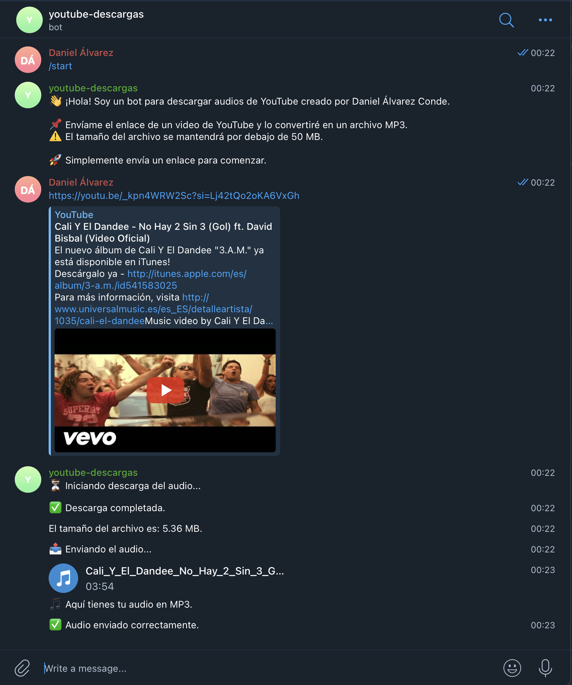

# youtube_telegram_bot

This Telegram bot allows users to download YouTube audio directly by sending a link to the bot. It leverages the `yt-dlp` library for downloading and supports configuration through environment variables using `dotenv` to preserve TOKEN's security.

## Configuration

To configure the bot, you need to set up the following environment variables in a `.env` file located in the root directory of the project:

- `TOKEN`: The Telegram bot token obtained from BotFather.
- `AUTHORIZED_USERS`: A comma-separated list of Telegram user IDs allowed to use the bot.

Example `.env` file:

```
TOKEN=your_telegram_bot_token
AUTHORIZED_USERS=123456789,987654321
```

Allowing only authorized users to access your bot is crucial for security and functionality. If you prefer to allow anyone to use your bot, you can leave the `AUTHORIZED_USERS` variable empty in the `.env` file or take the if condition out in the bot's python script.

To get your Telegram user ID, follow these steps:

1. Open Telegram and search for the bot `@userinfobot`.
2. Start a chat with the bot by clicking the "Start" button.
3. The bot will reply with your user information, including your user ID.

Use this user ID to add yourself to the `AUTHORIZED_USERS` list in the `.env` file.

## Installation

To install the dependencies required for this project, run the following command:

```bash
pip3 install python-telegram-bot yt-dlp dotenv
```

## Running the Bot

To execute and test the bot, run the following command in the root directory of the project. You may be asked by your system to start a python environment not to break system packages:

```bash
python3 youtube_telegram_bot.py
```

Ensure that the `.env` file is properly configured before running the bot.

## Setting Up Automatic Startup

To enable the bot to start automatically on system startup, a shell script has been provided. Follow these steps:

1. Navigate to the directory containing the script:
    ```bash
    cd /home/<user_name>/Documents/youtube_telegram_bot
    ```

2. Make the script executable:
    ```bash
    chmod +x set_up_auto_start.sh
    ```

3. Execute the script:
    ```bash
    sh set_up_auto_start.sh
    ```

This script will handle the creation and configuration of the necessary systemd service file, ensuring the bot starts automatically on system boot.


## How to Interact with the Bot

Below is an example of how to interact with the bot on Telegram:



Ensure that your Telegram user ID is included in the `AUTHORIZED_USERS` list in the `.env` file to interact with the bot.